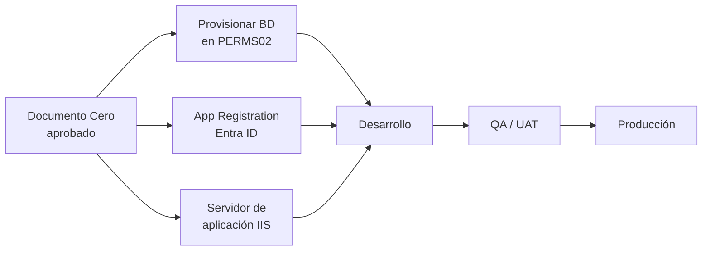

# Documento Cero — Prerrequisitos de implementación

Este es el punto de partida formal de la construcción: reúne todo lo que debe existir, estar aprobado o al menos gestionado **antes** de que el equipo de desarrollo escriba la primera línea de código del Catálogo de Citizen Development &amp; IA. Su objetivo es evitar que el desarrollo arranque y se detenga a mitad de camino por falta de un acceso, una cuenta de servicio o una definición de negocio.

No es un documento técnico de diseño (eso lo cubren `06-diseno-bd-sql-server.md` y `07-arquitectura-despliegue-componentes.md`) sino un **checklist de condiciones habilitantes**, con responsable y estado.

## 1. Infraestructura de aplicación (servidor web / IIS)

| Ítem | Detalle | Estado |
|---|---|---|
| Servidor de aplicación (IIS) | **Decidido**: se reutiliza **PERMS220** (`perms220.unique-yanbal.com`), el mismo servidor donde hoy corre DashTicketsSDM. Paso a paso completo en `10-guia-despliegue-perms220.md` | Definido |
| .NET Hosting Bundle | Instalar el ASP.NET Core Hosting Bundle (.NET 8 LTS) en PERMS220, con el módulo `ANCM` (ASP.NET Core Module) configurado en IIS — ver `10-guia-despliegue-perms220.md`, sección 1 | Pendiente de ejecución por Infraestructura |
| Sitio / App Pool en IIS | Crear el sitio/aplicación IIS y el Application Pool dedicado (modo "No Managed Code") en PERMS220 — ver `10-guia-despliegue-perms220.md`, sección 2 | Pendiente de ejecución por Infraestructura |
| Certificado SSL / dominio público | Definir si se publica como subcarpeta de `perms220.unique-yanbal.com` o con dominio propio, y coordinar con el reverse proxy que ya usan otros dashboards de PERMS220 — ver `10-guia-despliegue-perms220.md`, sección 8 | Pendiente de decisión de nomenclatura |
| Ambientes | Confirmar si se replican Dev / QA-UAT / Producción, o solo UAT + Producción | Pendiente de decisión |

## 2. Infraestructura de datos (SQL Server — PERMS02)

| Ítem | Detalle | Estado |
|---|---|---|
| Acceso al servidor PERMS02 | Confirmar que el servidor SQL Server en PERMS02 ya existe y está operativo (según lo indicado por el solicitante) | A confirmar con el equipo de Infraestructura/DBA |
| Creación de la base de datos nueva | Nombre propuesto: **`YanbalCitizenDevIA`** (siguiendo la convención de nombres ya usada en Yanbal, p. ej. `YanbalITMDR` para DashTicketsSDM) — sujeto a confirmación del estándar de nomenclatura vigente | Pendiente de aprovisionamiento por el DBA |
| Collation y configuración | Definir collation estándar corporativo (ej. `Modern_Spanish_CI_AS` o el que use el resto de bases en PERMS02, por consistencia) | Pendiente |
| Cuenta de acceso a la base de datos | Definir si la App se conecta con autenticación integrada de Windows (cuenta de servicio de dominio) o con un login SQL dedicado — se recomienda cuenta de servicio de dominio de solo esta aplicación, sin privilegios de `sysadmin` | Pendiente de decisión |
| Backups y mantenimiento | Incluir la nueva base de datos en el plan de backups y mantenimiento estándar de PERMS02 | Pendiente de coordinar con DBA |
| Tamaño inicial estimado | Volumen bajo (catálogo, no transaccional masivo): se estima un crecimiento moderado; no se prevén requerimientos especiales de almacenamiento en el primer año | Informativo |

## 3. Identidad y accesos (Azure AD / Microsoft Entra ID)

| Ítem | Detalle | Estado |
|---|---|---|
| App Registration en Entra ID | Registrar la aplicación en el tenant corporativo de Yanbal (`yanbal.onmicrosoft.com` o el tenant real vigente), obtener `Client ID`, `Tenant ID`, configurar `Redirect URI` hacia el servidor de aplicación definido en la sección 1 | Pendiente — requiere al equipo de IT/Seguridad con permisos de administrador de Entra ID |
| Flujo de autenticación | OIDC / OAuth2 (Authorization Code Flow con PKCE), vía `Microsoft.Identity.Web` en ASP.NET Core — **Azure AD se usa únicamente para autenticar (confirmar identidad y correo corporativo)**, no para determinar roles | Definido (ver `07-arquitectura-despliegue-componentes.md`) |
| Mapeo de rol Administrador | **Decisión del solicitante**: el rol Administrador se gestiona dentro de la propia App (columna `Usuario.EsAdministrador`, ver `06-diseno-bd-sql-server.md`), no por membresía a grupos de Azure AD. No se requieren grupos de seguridad AD nuevos para este propósito | Definido — sin dependencia externa |
| Administrador inicial (bootstrap) | El primer Administrador se precarga por script (`sql/02_seed_inicial.sql`, usuario `luis.castro@yanbal.com`); desde ahí, los siguientes administradores se asignan desde el módulo interno "Gestión de administradores" (ver `03-alcance-funcional.md`) | Definido |

## 4. Datos y contenido inicial

| Ítem | Detalle | Estado |
|---|---|---|
| Catálogo real de plataformas de IA aprobadas | La hoja "Catálogo de plataformas" del Excel base está **pendiente de definición oficial** (solo trae una fila de ejemplo). **Decisión del solicitante**: no es bloqueante para arrancar — el maestro `Plataforma` sale vacío a producción y se va completando sobre la marcha, agregando cada plataforma desde el módulo de Administración de plataformas en el momento en que un usuario necesite registrar una solución que la use | No bloqueante — se completa progresivamente |
| Migración de histórico | Confirmar si existe, fuera del archivo de ejemplo usado para este análisis, un Excel real con soluciones ya registradas en el Comité que deba migrarse a la base de datos nueva | Pendiente de confirmar con el solicitante |
| Datos maestros de País / Área | Confirmar si los valores de "País" y "Área" deben salir de un maestro corporativo existente (p. ej. estructura organizacional en AD/HR) o se administran localmente en la App | Pendiente de decisión |

## 5. Notificaciones (comprobante de registro)

| Ítem | Detalle | Estado |
|---|---|---|
| Servicio de envío de correo | Definir si se usa un relay SMTP corporativo interno o Microsoft Graph API (`Mail.Send`) para el correo de comprobante de registro | Pendiente de decisión — Graph API es la opción recomendada si la App ya usa Entra ID para autenticación, por reutilizar el mismo modelo de permisos |
| Remitente | Definir la cuenta/buzón remitente del comprobante (ej. `no-reply-catalogoia@yanbal.com`) | Pendiente |
| Plantilla del correo | Diseño de la plantilla HTML del comprobante — se define junto con el resto de la identidad visual (`04-identidad-visual.md`) al iniciar el desarrollo del módulo de registro | Pendiente, no bloqueante |

## 6. Gobierno y responsables

| Ítem | Detalle | Estado |
|---|---|---|
| Sponsor / dueño de negocio | Comité de Citizen Development (a confirmar nombre de contacto principal) | Pendiente |
| Responsable técnico / arquitectura | Luis Castro — IT Architecture Consulting | Confirmado |
| Repositorio de código | Crear proyecto/repositorio en Azure DevOps (herramienta ya usada por el equipo) | Pendiente |
| Pipeline CI/CD | Definir pipeline de build/despliegue hacia los ambientes definidos en la sección 1 | Pendiente, se define en `07-arquitectura-despliegue-componentes.md` |

## 7. Secuencia recomendada

Los tres prerrequisitos de infraestructura (BD, Entra ID, servidor IIS) pueden gestionarse **en paralelo** una vez aprobado este documento; el desarrollo puede iniciar sobre un ambiente local/Dev con una base de datos SQL Server local o de pruebas mientras se resuelven los accesos definitivos a PERMS02, siempre que el modelo de datos (`06-diseno-bd-sql-server.md`) se mantenga como contrato único.

## 8. Bloqueantes reales para salir a producción

Los dos puntos que se habían identificado como bloqueantes de negocio ya fueron resueltos por decisión del solicitante:

1. **Catálogo real de plataformas de IA aprobadas** (sección 4) — ya **no es bloqueante**: el maestro `Plataforma` sale vacío a producción y se completa progresivamente desde el módulo de Administración de plataformas, conforme aparezcan solicitudes reales de registro que lo requieran.
2. **Definición de quién es Administrador** (sección 3) — ya **no depende de Azure AD**: el rol se gestiona dentro de la propia App (`Usuario.EsAdministrador`), con un primer administrador precargado por script y el resto asignado desde el módulo interno "Gestión de administradores". Azure AD queda acotado a autenticar el acceso (SSO corporativo), no a resolver roles.

Con esto, no quedan bloqueantes de negocio pendientes para iniciar el desarrollo — solo los prerrequisitos de infraestructura de las secciones 1 y 2 (servidor de aplicación y aprovisionamiento de la base de datos en PERMS02).
