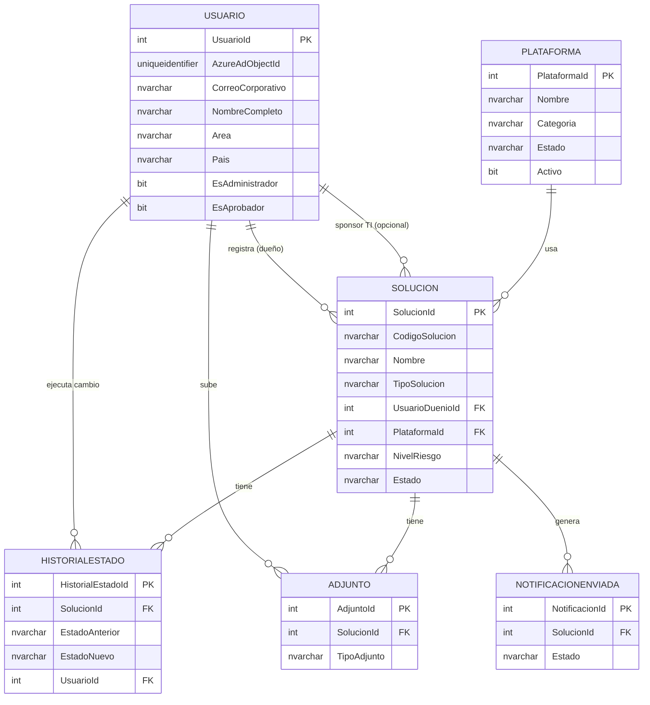

# Diseño de base de datos — SQL Server en PERMS02

Base de datos nueva y dedicada a esta App, propuesta con el nombre **`YanbalCitizenDevIA`** (a confirmar con el DBA según el estándar de nomenclatura vigente — ver `05-documento-cero-prerequisitos.md`). Todo el contenido hoy manual del Excel pasa a vivir aquí; el Excel deja de ser fuente de verdad.

## 1. Modelo entidad-relación (lógico)



## 2. Script de creación (DDL)

```sql
-- =========================================================
-- YanbalCitizenDevIA — Script de creación inicial
-- Servidor destino: PERMS02
-- =========================================================
CREATE DATABASE YanbalCitizenDevIA;
GO
ALTER DATABASE YanbalCitizenDevIA SET RECOVERY SIMPLE; -- ajustar según política de backups del DBA
GO
USE YanbalCitizenDevIA;
GO

-- ---------------------------------------------------------
-- Usuario: caché local de identidades resueltas desde Azure AD
-- ---------------------------------------------------------
CREATE TABLE dbo.Usuario (
    UsuarioId           INT IDENTITY(1,1)   NOT NULL,
    AzureAdObjectId      UNIQUEIDENTIFIER    NOT NULL,
    CorreoCorporativo    NVARCHAR(256)       NOT NULL,
    NombreCompleto       NVARCHAR(200)       NOT NULL,
    Area                 NVARCHAR(150)       NULL,
    Pais                 NVARCHAR(100)       NULL,
    EsAdministrador      BIT                 NOT NULL CONSTRAINT DF_Usuario_EsAdministrador DEFAULT (0),
    EsAprobador          BIT                 NOT NULL CONSTRAINT DF_Usuario_EsAprobador DEFAULT (0),
    FechaUltimoAcceso    DATETIME2(0)        NULL,
    FechaCreacion        DATETIME2(0)        NOT NULL CONSTRAINT DF_Usuario_FechaCreacion DEFAULT (SYSUTCDATETIME()),
    CONSTRAINT PK_Usuario PRIMARY KEY CLUSTERED (UsuarioId),
    CONSTRAINT UQ_Usuario_AzureAdObjectId UNIQUE (AzureAdObjectId),
    CONSTRAINT UQ_Usuario_Correo UNIQUE (CorreoCorporativo)
);
GO

-- ---------------------------------------------------------
-- Plataforma: maestro editable de plataformas de IA aprobadas
-- (reemplaza la hoja "Catálogo de plataformas" del Excel)
-- ---------------------------------------------------------
CREATE TABLE dbo.Plataforma (
    PlataformaId    INT IDENTITY(1,1)  NOT NULL,
    Nombre          NVARCHAR(150)      NOT NULL,
    Categoria       NVARCHAR(100)      NULL,
    Estado          NVARCHAR(50)       NOT NULL CONSTRAINT DF_Plataforma_Estado DEFAULT ('En evaluación'),
    Comentario      NVARCHAR(500)      NULL,
    Activo          BIT                NOT NULL CONSTRAINT DF_Plataforma_Activo DEFAULT (1),
    CreadoPorId     INT                NOT NULL,
    FechaCreacion   DATETIME2(0)       NOT NULL CONSTRAINT DF_Plataforma_FechaCreacion DEFAULT (SYSUTCDATETIME()),
    CONSTRAINT PK_Plataforma PRIMARY KEY CLUSTERED (PlataformaId),
    CONSTRAINT UQ_Plataforma_Nombre UNIQUE (Nombre),
    CONSTRAINT CK_Plataforma_Estado CHECK (Estado IN (N'Aprobada', N'En evaluación', N'Descontinuada')),
    CONSTRAINT FK_Plataforma_CreadoPor FOREIGN KEY (CreadoPorId) REFERENCES dbo.Usuario (UsuarioId)
);
GO

-- ---------------------------------------------------------
-- Contador: soporte para el correlativo humano CD-AAAA-###
-- ---------------------------------------------------------
CREATE TABLE dbo.SolucionContador (
    Anio            INT             NOT NULL,
    UltimoNumero    INT             NOT NULL CONSTRAINT DF_SolucionContador_Ultimo DEFAULT (0),
    CONSTRAINT PK_SolucionContador PRIMARY KEY CLUSTERED (Anio)
);
GO

-- ---------------------------------------------------------
-- Función: cálculo de Nivel de riesgo (misma regla del Excel)
-- ---------------------------------------------------------
CREATE FUNCTION dbo.fn_NivelRiesgo
(
    @EsProcesoCritico              BIT,
    @RequiereConexionCentral       BIT,
    @UsaPii                        BIT,
    @RequierePublicacionInternet   BIT,
    @RequiereInfraDedicada         NVARCHAR(20),
    @AlcanceUso                    NVARCHAR(20)
)
RETURNS NVARCHAR(10)
WITH SCHEMABINDING
AS
BEGIN
    RETURN (
        CASE
            WHEN @EsProcesoCritico = 1
              OR @RequiereConexionCentral = 1
              OR @UsaPii = 1
              OR @RequierePublicacionInternet = 1
              OR @RequiereInfraDedicada IN (N'Si')
            THEN N'Nivel 3'
            WHEN @AlcanceUso IN (N'Departamental', N'Multi-área', N'Multi-país')
            THEN N'Nivel 2'
            ELSE N'Nivel 1'
        END
    );
END;
GO

-- ---------------------------------------------------------
-- Solucion: tabla principal — un registro por solución de
-- Citizen Development / IA (equivalente a una fila del Excel,
-- más los campos ampliados de 02-modelo-datos-ampliado.md)
-- ---------------------------------------------------------
CREATE TABLE dbo.Solucion (
    SolucionId                     INT IDENTITY(1,1)  NOT NULL,
    CodigoSolucion                 NVARCHAR(20)       NOT NULL,          -- CD-2026-001
    Nombre                         NVARCHAR(250)      NOT NULL,
    TipoSolucion                   NVARCHAR(50)       NOT NULL,
    DescripcionBreve               NVARCHAR(1000)     NULL,
    UsuarioDuenioId                INT                NOT NULL,
    Area                           NVARCHAR(150)      NOT NULL,
    Pais                           NVARCHAR(100)      NOT NULL,
    PlataformaId                   INT                NOT NULL,
    FechaCreacionSolucion          DATE               NOT NULL,          -- fecha de negocio (cuándo se creó la solución)
    EsProcesoCritico               BIT                NOT NULL,
    AlcanceUso                     NVARCHAR(20)        NOT NULL,
    RequiereConexionCentral        BIT                NOT NULL,
    UsaPii                         BIT                NOT NULL,
    RequierePublicacionInternet    BIT                NOT NULL,
    RequiereInfraDedicada          NVARCHAR(20)       NOT NULL,
    NivelRiesgo AS dbo.fn_NivelRiesgo(EsProcesoCritico, RequiereConexionCentral, UsaPii, RequierePublicacionInternet, RequiereInfraDedicada, AlcanceUso) PERSISTED,
    RiesgoJustificacionOverride    NVARCHAR(1000)     NULL,              -- excepción documentada del Comité (no reemplaza el cálculo)
    RiesgoOverridePorId            INT                NULL,
    Estado                         NVARCHAR(30)       NOT NULL CONSTRAINT DF_Solucion_Estado DEFAULT (N'Registrado'),
    RevisadoPor                    NVARCHAR(50)       NULL,
    FechaUltimaRevision            DATE               NULL,
    ProximaRevision AS (
        CASE
            WHEN dbo.fn_NivelRiesgo(EsProcesoCritico, RequiereConexionCentral, UsaPii, RequierePublicacionInternet, RequiereInfraDedicada, AlcanceUso) IN (N'Nivel 1', N'Nivel 2')
                 AND FechaUltimaRevision IS NOT NULL
            THEN DATEADD(DAY, 180, FechaUltimaRevision)
            ELSE NULL
        END
    ) PERSISTED,
    Comentarios                    NVARCHAR(2000)     NULL,
    EnlaceAcceso                   NVARCHAR(500)      NULL,
    NivelMadurez                   NVARCHAR(20)       NULL,
    ClasificacionInformacion       NVARCHAR(20)       NULL,
    AudienciaEstimada              INT                NULL,
    SponsorTiId                    INT                NULL,
    FechaBaja                      DATE               NULL,
    Etiquetas                      NVARCHAR(300)      NULL,
    FechaRegistro                  DATETIME2(0)       NOT NULL CONSTRAINT DF_Solucion_FechaRegistro DEFAULT (SYSUTCDATETIME()),
    FechaModificacion              DATETIME2(0)       NOT NULL CONSTRAINT DF_Solucion_FechaModificacion DEFAULT (SYSUTCDATETIME()),
    CONSTRAINT PK_Solucion PRIMARY KEY CLUSTERED (SolucionId),
    CONSTRAINT UQ_Solucion_Codigo UNIQUE (CodigoSolucion),
    CONSTRAINT FK_Solucion_UsuarioDuenio FOREIGN KEY (UsuarioDuenioId) REFERENCES dbo.Usuario (UsuarioId),
    CONSTRAINT FK_Solucion_Plataforma FOREIGN KEY (PlataformaId) REFERENCES dbo.Plataforma (PlataformaId),
    CONSTRAINT FK_Solucion_SponsorTi FOREIGN KEY (SponsorTiId) REFERENCES dbo.Usuario (UsuarioId),
    CONSTRAINT FK_Solucion_RiesgoOverridePor FOREIGN KEY (RiesgoOverridePorId) REFERENCES dbo.Usuario (UsuarioId),
    CONSTRAINT CK_Solucion_Tipo CHECK (TipoSolucion IN (N'Dashboard', N'Reporte', N'Automatización', N'Agente de IA', N'App', N'Bot', N'Otro')),
    CONSTRAINT CK_Solucion_Alcance CHECK (AlcanceUso IN (N'Personal', N'Departamental', N'Multi-área', N'Multi-país')),
    CONSTRAINT CK_Solucion_InfraDedicada CHECK (RequiereInfraDedicada IN (N'Si', N'No', N'Entorno compartido', N'Sandbox personal')),
    CONSTRAINT CK_Solucion_Estado CHECK (Estado IN (N'Registrado', N'En revisión', N'Aprobado - Comité Citizen Dev', N'Aprobado - Comité N-1', N'Rechazado', N'Reclasificado')),
    CONSTRAINT CK_Solucion_RevisadoPor CHECK (RevisadoPor IN (N'N/A - autoregistro', N'Comité de Citizen Development', N'Comité N-1')),
    CONSTRAINT CK_Solucion_Madurez CHECK (NivelMadurez IN (N'Piloto', N'En producción', N'Descontinuado')),
    CONSTRAINT CK_Solucion_Clasificacion CHECK (ClasificacionInformacion IN (N'Pública', N'Interna', N'Confidencial', N'Restringida'))
);
GO

CREATE INDEX IX_Solucion_Estado ON dbo.Solucion (Estado) INCLUDE (NivelRiesgo);
CREATE INDEX IX_Solucion_NivelRiesgo ON dbo.Solucion (NivelRiesgo);
CREATE INDEX IX_Solucion_Pais ON dbo.Solucion (Pais);
CREATE INDEX IX_Solucion_Tipo ON dbo.Solucion (TipoSolucion);
CREATE INDEX IX_Solucion_Plataforma ON dbo.Solucion (PlataformaId);
CREATE INDEX IX_Solucion_ProximaRevision ON dbo.Solucion (ProximaRevision) WHERE ProximaRevision IS NOT NULL;
GO

-- ---------------------------------------------------------
-- HistorialEstado: auditoría de cambios de estado (no existe
-- en el Excel — el Excel solo guarda el último estado)
-- ---------------------------------------------------------
CREATE TABLE dbo.HistorialEstado (
    HistorialEstadoId   INT IDENTITY(1,1)  NOT NULL,
    SolucionId          INT                NOT NULL,
    EstadoAnterior       NVARCHAR(30)      NULL,
    EstadoNuevo          NVARCHAR(30)      NOT NULL,
    UsuarioId            INT                NOT NULL,
    FechaCambio          DATETIME2(0)      NOT NULL CONSTRAINT DF_HistorialEstado_Fecha DEFAULT (SYSUTCDATETIME()),
    Comentario           NVARCHAR(1000)    NULL,
    CONSTRAINT PK_HistorialEstado PRIMARY KEY CLUSTERED (HistorialEstadoId),
    CONSTRAINT FK_HistorialEstado_Solucion FOREIGN KEY (SolucionId) REFERENCES dbo.Solucion (SolucionId),
    CONSTRAINT FK_HistorialEstado_Usuario FOREIGN KEY (UsuarioId) REFERENCES dbo.Usuario (UsuarioId)
);
CREATE INDEX IX_HistorialEstado_Solucion ON dbo.HistorialEstado (SolucionId, FechaCambio);
GO

-- ---------------------------------------------------------
-- Adjunto: evidencia asociada a una solución (no existe en
-- el Excel)
-- ---------------------------------------------------------
CREATE TABLE dbo.Adjunto (
    AdjuntoId            INT IDENTITY(1,1)  NOT NULL,
    SolucionId           INT                NOT NULL,
    NombreArchivo        NVARCHAR(300)      NOT NULL,
    TipoAdjunto          NVARCHAR(50)       NOT NULL,
    RutaAlmacenamiento   NVARCHAR(500)      NOT NULL,
    SubidoPorId          INT                NOT NULL,
    FechaCarga           DATETIME2(0)       NOT NULL CONSTRAINT DF_Adjunto_Fecha DEFAULT (SYSUTCDATETIME()),
    CONSTRAINT PK_Adjunto PRIMARY KEY CLUSTERED (AdjuntoId),
    CONSTRAINT FK_Adjunto_Solucion FOREIGN KEY (SolucionId) REFERENCES dbo.Solucion (SolucionId),
    CONSTRAINT FK_Adjunto_SubidoPor FOREIGN KEY (SubidoPorId) REFERENCES dbo.Usuario (UsuarioId),
    CONSTRAINT CK_Adjunto_Tipo CHECK (TipoAdjunto IN (N'Captura de pantalla', N'Acta de comité', N'Otro documento'))
);
GO

-- ---------------------------------------------------------
-- NotificacionEnviada: auditoría del comprobante de registro
-- (soporta el requisito de "prueba del registro")
-- ---------------------------------------------------------
CREATE TABLE dbo.NotificacionEnviada (
    NotificacionId   INT IDENTITY(1,1)  NOT NULL,
    SolucionId       INT                NOT NULL,
    TipoNotificacion NVARCHAR(50)       NOT NULL CONSTRAINT DF_Notificacion_Tipo DEFAULT (N'ComprobanteRegistro'),
    CorreoDestino    NVARCHAR(256)      NOT NULL,
    FechaEnvio       DATETIME2(0)       NOT NULL CONSTRAINT DF_Notificacion_Fecha DEFAULT (SYSUTCDATETIME()),
    Estado           NVARCHAR(20)       NOT NULL,
    MensajeError     NVARCHAR(1000)     NULL,
    CONSTRAINT PK_NotificacionEnviada PRIMARY KEY CLUSTERED (NotificacionId),
    CONSTRAINT FK_Notificacion_Solucion FOREIGN KEY (SolucionId) REFERENCES dbo.Solucion (SolucionId),
    CONSTRAINT CK_Notificacion_Estado CHECK (Estado IN (N'Enviado', N'Fallido'))
);
GO
```

## 3. Generación del código correlativo `CD-AAAA-###`

Se replica el mismo patrón de correlativo por bloqueo (`UPDLOCK, HOLDLOCK`) ya usado en otros proyectos del solicitante (p. ej. `REQ-UT-AAAA-####` en GCA), para evitar duplicados bajo registros concurrentes:

```sql
CREATE PROCEDURE dbo.sp_GenerarCodigoSolucion
    @Codigo NVARCHAR(20) OUTPUT
AS
BEGIN
    SET NOCOUNT ON;
    DECLARE @Anio INT = YEAR(SYSUTCDATETIME());
    DECLARE @Numero INT;

    BEGIN TRAN;
        IF NOT EXISTS (SELECT 1 FROM dbo.SolucionContador WITH (UPDLOCK, HOLDLOCK) WHERE Anio = @Anio)
            INSERT INTO dbo.SolucionContador (Anio, UltimoNumero) VALUES (@Anio, 0);

        UPDATE dbo.SolucionContador WITH (UPDLOCK, HOLDLOCK)
            SET UltimoNumero = UltimoNumero + 1,
                @Numero = UltimoNumero + 1
        WHERE Anio = @Anio;
    COMMIT TRAN;

    SET @Codigo = N'CD-' + CAST(@Anio AS NVARCHAR(4)) + N'-' + RIGHT(N'000' + CAST(@Numero AS NVARCHAR(3)), 3);
END;
GO
```

## 4. Datos semilla mínimos

La tabla `Plataforma` **no** se precarga con las plataformas reales — eso está pendiente de definición oficial del Comité (ver `05-documento-cero-prerequisitos.md`, sección 4). Sí conviene precargar, al desplegar, un usuario administrador inicial para poder operar el módulo de administración de plataformas desde el primer día:

```sql
INSERT INTO dbo.Usuario (AzureAdObjectId, CorreoCorporativo, NombreCompleto, EsAdministrador)
VALUES (NEWID(), N'luis.castro@yanbal.com', N'Luis Castro', 1);
-- Reemplazar NEWID() por el Object ID real de Azure AD del usuario al desplegar.
```

## 5. Estrategia de migraciones (EF Core)

Se recomienda **Code-First con EF Core** para el desarrollo, pero con gobierno de DBA en ambientes controlados:

- **Dev**: `dotnet ef database update` aplica migraciones libremente contra una instancia de desarrollo (local o compartida).
- **UAT / Producción (PERMS02)**: las migraciones se generan como script SQL (`dotnet ef migrations script`) y se entregan al DBA para revisión y aplicación manual — igual que el resto de bases de datos corporativas en PERMS02, sin que la aplicación tenga permisos de `ALTER`/`CREATE` en producción.
- La cuenta de servicio de la aplicación en producción solo requiere `db_datareader` + `db_datawriter` + `EXECUTE` sobre los procedimientos almacenados — nunca `db_owner`.

## 6. Pendientes a validar con el DBA de PERMS02

- Collation estándar del servidor (para igualar la de esta base nueva).
- Política de backups y ventana de mantenimiento a aplicar.
- Si existe un estándar de nomenclatura obligatorio distinto a `YanbalCitizenDevIA`.
- Tamaño inicial de archivo de datos/log y crecimiento automático (`autogrowth`) recomendado para PERMS02.

## 7. Migración incremental — rol Aprobador (2026-09-07)

Retroalimentación de usuarios en producción (punto 6 de la ronda de pruebas): se agrega el rol **Aprobador**, independiente de Administrador, con acceso solo a "Revisión y aprobación". Requiere una única columna nueva en `dbo.Usuario` — el resto del cambio (claims, políticas de autorización, UI) vive en el código de la App, no en el esquema.

```sql
-- =========================================================
-- Migración incremental: rol Aprobador
-- Ejecutar en YanbalCitizenDevIA (PERMS02) — un solo ALTER, sin downtime.
-- =========================================================
USE YanbalCitizenDevIA;
GO

ALTER TABLE dbo.Usuario
    ADD EsAprobador BIT NOT NULL CONSTRAINT DF_Usuario_EsAprobador DEFAULT (0);
GO
```

No se requiere backfill: todos los usuarios existentes quedan con `EsAprobador = 0` (comportamiento anterior sin cambios) hasta que un Administrador otorgue el rol explícitamente desde "Gestión de Usuarios" (antes "Gestión de administradores" — renombrado en el mismo cambio).

El script de creación inicial de la sección 2 ya se actualizó para incluir `EsAprobador` desde el `CREATE TABLE`, de modo que un despliegue nuevo desde cero no necesita este `ALTER` — solo aplica a la base `YanbalCitizenDevIA` ya existente en PERMS02.
