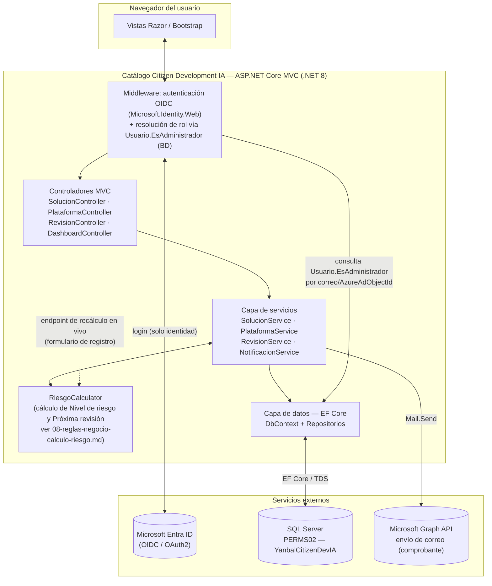
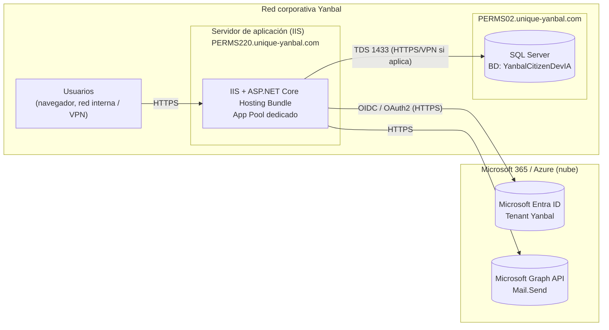

# Arquitectura y despliegue de componentes

## 1. Vista lógica de componentes

La aplicación sigue una arquitectura en capas clásica de ASP.NET Core MVC, sin microservicios — no se justifican dado el volumen y alcance de un catálogo interno.

### Responsabilidad de cada capa

- **Middleware de autenticación/autorización**: valida el token OIDC emitido por Entra ID — esto confirma **identidad** (quién es el usuario: nombre, correo corporativo), nada más. Inmediatamente después del login, una `IClaimsTransformation` (o filtro equivalente) busca al usuario en `dbo.Usuario` por `AzureAdObjectId`/correo; si no existe, lo crea (alta automática en el primer login); si existe, lee `EsAdministrador` y agrega un claim interno de rol (`EsAdministrador = true/false`) a la identidad de la sesión. Las políticas de autorización (`[Authorize(Policy = "EsAdministrador")]`) sobre los controladores/acciones de administración se evalúan contra ese claim interno, nunca contra grupos de Azure AD — Yanbal no necesita crear ni mantener grupos de AD para este propósito (decisión confirmada, ver `05-documento-cero-prerequisitos.md`, sección 3).
- **Gestión de administradores**: módulo de UI (`03-alcance-funcional.md`, módulo 7) donde un Administrador otorga o retira `EsAdministrador` a otros usuarios ya autenticados alguna vez en la App. El primer administrador se precarga por script (`sql/02_seed_inicial.sql`); de ahí en adelante el propio Comité se auto-gestiona desde este módulo, sin depender de IT/Seguridad para cada cambio.
- **Controladores MVC**: uno por módulo funcional (`03-alcance-funcional.md`) — registro, catálogo/consulta, administración de plataformas, revisión/aprobación, dashboard ejecutivo.
- **Capa de servicios**: contiene la lógica de negocio — orquesta la creación de una Solución (genera el código correlativo vía `sp_GenerarCodigoSolucion`, guarda el registro, dispara la notificación de comprobante), y el cambio de estado (registra en `HistorialEstado`).
- **`RiesgoCalculator`**: implementa en C# la misma fórmula de Nivel de riesgo y Próxima revisión que el Excel original (ver el detalle completo, casos de prueba y justificación en `08-reglas-negocio-calculo-riesgo.md`). Se usa desde dos puntos: (1) un endpoint de recálculo en vivo que el formulario de registro llama cada vez que el usuario cambia un campo relevante, para mostrar el badge de riesgo actualizado igual que hacía el Excel; y (2) opcionalmente como validación previa al guardar. El valor que finalmente queda persistido en la base de datos es siempre el que calcula la función SQL `dbo.fn_NivelRiesgo` (columnas `PERSISTED` en `Solucion`, ver `06-diseno-bd-sql-server.md`) — esa es la fuente autoritativa, a prueba de inserciones directas por SQL o cargas masivas que no pasen por la aplicación. `RiesgoCalculator` y `fn_NivelRiesgo` implementan matemáticamente la misma regla, documentada en un único lugar (`08-reglas-negocio-calculo-riesgo.md`) para que no puedan divergir con el tiempo; la regla **no** se reimplementa una tercera vez en JavaScript del navegador.
- **Capa de datos (EF Core)**: mapea 1:1 el modelo de `06-diseno-bd-sql-server.md`. Se usa el patrón repositorio solo donde aporta valor de testing (Solucion, Plataforma); el resto se consulta directamente vía `DbContext`.
- **NotificacionService**: arma y envía el correo de comprobante de registro vía Microsoft Graph API (`Mail.Send`, delegado en una cuenta de servicio o buzón compartido — ver `05-documento-cero-prerequisitos.md`, sección 5), y registra el resultado en `NotificacionEnviada`.

## 2. Vista física de despliegue

### Notas de la vista física

- El **servidor de aplicación** es **PERMS220** (`perms220.unique-yanbal.com`), el mismo servidor donde hoy corre DashTicketsSDM — decisión ya tomada, paso a paso completo de instalación y despliegue en `10-guia-despliegue-perms220.md`. Debe quedar en la misma red/zona que le permita alcanzar PERMS02 por el puerto 1433 (TDS) y salir a Internet (HTTPS) hacia Entra ID y Graph API.
- **PERMS02** aloja únicamente la base de datos nueva `YanbalCitizenDevIA`; no requiere instalación de componentes de aplicación.
- La comunicación hacia **Entra ID** y **Graph API** requiere que el servidor de aplicación tenga salida HTTPS a Internet (o vía proxy corporativo) — a validar con Seguridad/Infraestructura si hay reglas de firewall que deban abrirse explícitamente.

## 3. Ambientes y promoción

| Ambiente | Servidor de aplicación | Base de datos | Propósito |
|---|---|---|---|
| Desarrollo | Local (IIS Express / Kestrel) o servidor compartido de Dev | SQL Server local o instancia de Dev — **no** PERMS02 | Desarrollo diario, migraciones EF Core libres |
| UAT | PERMS220 (sitio/aplicación IIS independiente del de Producción — ver `10-guia-despliegue-perms220.md`) | `YanbalCitizenDevIA_UAT` en PERMS02 (o servidor de UAT equivalente) | Pruebas del Comité de Citizen Development antes de salir a producción |
| Producción | PERMS220 | `YanbalCitizenDevIA` en PERMS02 | Operación real |

El paso de UAT a Producción sigue el mismo control de despliegue automatizado UAT→PRD ya usado en otros proyectos de TI en Yanbal (ver el plan de cierre de accesos NSDY/SPY): los cambios de esquema de base de datos se aplican solo vía script revisado por el DBA, nunca por acceso directo de un desarrollador a Producción.

## 4. Seguridad de la cuenta de servicio

- La aplicación se conecta a SQL Server con una cuenta de servicio dedicada, sin privilegios de `sysadmin`, limitada a `db_datareader`, `db_datawriter` y `EXECUTE` sobre los procedimientos almacenados de `YanbalCitizenDevIA` (ver `06-diseno-bd-sql-server.md`, sección 5).
- Los secretos de configuración (cadena de conexión, `ClientSecret`/certificado de la App Registration de Entra ID) se gestionan vía **variables de entorno protegidas del App Pool** o un almacén de secretos corporativo (si Yanbal ya usa Azure Key Vault u otro, se debe adoptar el mismo estándar) — nunca en `appsettings.json` en texto plano.

## 5. Alcance de este documento

Este documento cubre la arquitectura de **la primera versión** de la App, alineada al alcance funcional aprobado. Quedan fuera de este alcance (a evaluar en una fase posterior si el catálogo crece): integración directa con el Data Lake corporativo para las soluciones marcadas con "Requiere conexión a sistema central", y un pipeline de aprobación con más de dos niveles de comité.
