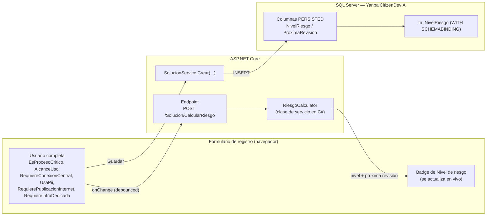

# Reglas de negocio — Cálculo del Nivel de Riesgo

Este documento existe porque el cálculo del Nivel de riesgo es la regla de negocio más importante de todo el catálogo (determina el nivel de gobierno/aprobación que requiere cada solución) y **debe comportarse exactamente igual que la fórmula del Excel original**, tanto al guardar en base de datos como al usarse dentro de la aplicación. Complementa a `06-diseno-bd-sql-server.md` (que ya define la función SQL `dbo.fn_NivelRiesgo`) dejando explícito que la misma regla también vive en la capa de aplicación, con los mismos nombres de campo, y por qué eso no es una duplicación peligrosa sino una réplica intencional de un único origen de verdad.

## 1. La fórmula original (Excel, columna P "Nivel de riesgo")

Tal como quedó documentada en `01-diccionario-datos-excel.md`, la fórmula evalúa, en este orden, las columnas J a O (la plantilla original indica explícitamente: *"Las columnas J a O activan el cálculo automático de la columna 'Nivel de riesgo' (P) — no editar P ni T manualmente"*):

```
SI (J="Sí" O L="Sí" O M="Sí" O N="Sí" O O="Sí")              → Nivel 3
SI NO, Y K ∈ {Departamental, Multi-área, Multi-país}         → Nivel 2
EN CUALQUIER OTRO CASO (K = Personal, sin señales de riesgo) → Nivel 1
```

Columnas de entrada (nombre de negocio → nombre de campo en la App, igual al usado en `06-diseno-bd-sql-server.md`):

| Columna Excel | Pregunta | Valores | Campo en BD / App |
|---|---|---|---|
| J | ¿Es parte de un proceso crítico de negocio? | Sí / No | `EsProcesoCritico` (bit) |
| K | Alcance de uso | Personal / Departamental / Multi-área / Multi-país | `AlcanceUso` (texto) |
| L | ¿Requiere conexión a sistema central / Data Lake? | Sí / No | `RequiereConexionCentral` (bit) |
| M | ¿Usa datos personales (PII)? | Sí / No | `UsaPii` (bit) |
| N | ¿Requiere publicación a Internet? | Sí / No | `RequierePublicacionInternet` (bit) |
| O | ¿Requiere infraestructura dedicada? | Sí / No / Entorno compartido / Sandbox personal | `RequiereInfraDedicada` (texto — **solo el valor "Sí" dispara Nivel 3**; "Entorno compartido" y "Sandbox personal" no) |

La columna T "Próxima revisión" depende del resultado anterior:

```
SI Nivel de riesgo en {Nivel 1, Nivel 2} → Fecha de última revisión + 180 días
SI Nivel de riesgo = Nivel 3             → "N/A"
```

**Punto ya señalado en `01-diccionario-datos-excel.md` y que se reitera aquí porque afecta directamente esta regla**: el Nivel 3 (el de mayor riesgo) es el único que *no* recibe una fecha de revisión periódica automática. Esto puede ser un defecto original del Excel más que una decisión de negocio deliberada — se recomienda confirmarlo con el Comité de Citizen Development antes de congelarlo tal cual en la nueva App (ver sección 5).

## 2. Dónde vive la regla en la nueva App: en dos capas, desde un único origen

La regla se implementa en **dos lugares**, y esto es intencional, no un descuido:

1. **Base de datos (autoritativa y a prueba de manipulación)** — función escalar `dbo.fn_NivelRiesgo` con `WITH SCHEMABINDING`, usada por las columnas calculadas `PERSISTED` `NivelRiesgo` y `ProximaRevision` de la tabla `Solucion`. Ver el DDL completo en `06-diseno-bd-sql-server.md`. Esta es la que garantiza que el dato guardado sea siempre correcto, incluso si alguien inserta filas directamente por SQL o por un proceso de carga masiva, sin pasar por la aplicación.
2. **Aplicación (para la experiencia de registro en tiempo real)** — una clase de servicio en C#, `RiesgoCalculator`, que el formulario de registro llama para **mostrarle al usuario el nivel de riesgo y la próxima revisión mientras completa el formulario**, replicando el comportamiento del Excel original (donde P y T se recalculaban solas apenas cambiaba una celda de entrada, y el usuario nunca las editaba a mano).

Lo que se evita explícitamente es una **tercera** implementación: la regla **no** se vuelve a escribir en JavaScript en el navegador. El recálculo en vivo del formulario se hace con una llamada del lado del cliente (fetch/AJAX) a un endpoint del servidor (`POST /Solucion/CalcularRiesgo`) que ejecuta la misma clase `RiesgoCalculator` que usa el resto del backend. Así hay exactamente **una** definición de la regla en C# (más la réplica equivalente en SQL, necesaria porque las columnas calculadas de SQL Server no pueden invocar código .NET), en vez de tres copias (SQL + C# + JS) que con el tiempo podrían divergir.



Esto reproduce exactamente el comportamiento del Excel: el usuario ve el nivel de riesgo actualizarse solo, nunca lo edita manualmente, y el valor que finalmente queda grabado es el que calcula la base de datos — que, por construcción, es el mismo valor que ya se le mostró en pantalla.

## 3. Implementación de referencia — `RiesgoCalculator` (C#)

Esta clase debe ubicarse en la capa de servicios (`SVC`/`RC` en `07-arquitectura-despliegue-componentes.md`) y ser la única fuente de la regla dentro del código .NET. Usa **los mismos nombres de campo** que la tabla `Solucion` y la función `dbo.fn_NivelRiesgo` de `06-diseno-bd-sql-server.md`, para que comparar ambas implementaciones lado a lado sea directo y no haya ambigüedad de mapeo. Cualquier cambio futuro a la regla se hace en ambos lugares a la vez, y este documento es el que se actualiza para que quede registrado.

```csharp
namespace CatalogoCitizenDevIA.Services;

public enum NivelRiesgo
{
    Nivel1 = 1,
    Nivel2 = 2,
    Nivel3 = 3
}

/// <summary>
/// Réplica exacta, en C#, de la función SQL dbo.fn_NivelRiesgo
/// (ver 06-diseno-bd-sql-server.md) y de la fórmula original del
/// Excel (columnas J a O -> P, y P -> T). Cualquier cambio a esta
/// regla debe reflejarse también en la función SQL y en este documento.
/// </summary>
public static class RiesgoCalculator
{
    private static readonly string[] AlcancesQueSubenANivel2 =
    {
        "Departamental", "Multi-área", "Multi-país"
    };

    public static NivelRiesgo CalcularNivelRiesgo(
        bool esProcesoCritico,           // columna J
        string alcanceUso,               // columna K: Personal | Departamental | Multi-área | Multi-país
        bool requiereConexionCentral,    // columna L
        bool usaPii,                     // columna M
        bool requierePublicacionInternet,// columna N
        string requiereInfraDedicada)    // columna O: Si | No | Entorno compartido | Sandbox personal
    {
        var esNivel3 =
            esProcesoCritico
            || requiereConexionCentral
            || usaPii
            || requierePublicacionInternet
            || string.Equals(requiereInfraDedicada, "Si", StringComparison.OrdinalIgnoreCase);

        if (esNivel3)
        {
            return NivelRiesgo.Nivel3;
        }

        if (AlcancesQueSubenANivel2.Contains(alcanceUso, StringComparer.OrdinalIgnoreCase))
        {
            return NivelRiesgo.Nivel2;
        }

        return NivelRiesgo.Nivel1;
    }

    /// <summary>
    /// Réplica de la columna T "Próxima revisión". Devuelve null para
    /// Nivel 3 (equivalente al "N/A" del Excel) — ver la observación en
    /// la sección 5 sobre si este comportamiento debe mantenerse.
    /// </summary>
    public static DateOnly? CalcularProximaRevision(
        NivelRiesgo nivelRiesgo,
        DateOnly? fechaUltimaRevision)
    {
        if (fechaUltimaRevision is null)
        {
            return null;
        }

        return nivelRiesgo switch
        {
            NivelRiesgo.Nivel1 or NivelRiesgo.Nivel2 => fechaUltimaRevision.Value.AddDays(180),
            NivelRiesgo.Nivel3 => null,
            _ => throw new ArgumentOutOfRangeException(nameof(nivelRiesgo))
        };
    }
}
```

Endpoint de recálculo en vivo usado por el formulario de registro (llamado por JavaScript solo para hacer el `fetch`, nunca para evaluar la regla):

```csharp
[HttpPost]
public IActionResult CalcularRiesgo([FromBody] CalcularRiesgoRequest request)
{
    var nivel = RiesgoCalculator.CalcularNivelRiesgo(
        request.EsProcesoCritico,
        request.AlcanceUso,
        request.RequiereConexionCentral,
        request.UsaPii,
        request.RequierePublicacionInternet,
        request.RequiereInfraDedicada);

    var proximaRevision = RiesgoCalculator.CalcularProximaRevision(nivel, DateOnly.FromDateTime(DateTime.Today));

    return Json(new { nivel = nivel.ToString(), proximaRevision });
}
```

## 4. Tabla de casos de prueba (QA — usar para probar C# y SQL por igual)

Esta tabla debe usarse como set de pruebas unitarias de `RiesgoCalculator` **y** como pruebas de la función `fn_NivelRiesgo` en SQL, precisamente para verificar que ambas implementaciones nunca diverjan. Refleja los mismos campos y valores de `06-diseno-bd-sql-server.md`.

| # | J EsProcesoCritico | K AlcanceUso | L RequiereConexionCentral | M UsaPii | N RequierePublicacionInternet | O RequiereInfraDedicada | Nivel esperado | Próxima revisión |
|---|---|---|---|---|---|---|---|---|
| 1 | No | Personal | No | No | No | No | Nivel 1 | Últ. revisión + 180 días |
| 2 | No | Departamental | No | No | No | No | Nivel 2 | Últ. revisión + 180 días |
| 3 | No | Multi-país | No | No | No | Sandbox personal | Nivel 2 | Últ. revisión + 180 días |
| 4 | Sí | Personal | No | No | No | No | Nivel 3 | N/A |
| 5 | No | Personal | Sí | No | No | No | Nivel 3 | N/A |
| 6 | No | Personal | No | Sí | No | No | Nivel 3 | N/A |
| 7 | No | Personal | No | No | Sí | No | Nivel 3 | N/A |
| 8 | No | Personal | No | No | No | Si | Nivel 3 | N/A |
| 9 | No | Personal | No | No | No | Entorno compartido | Nivel 1 (infra dedicada solo cuenta si es exactamente "Si") | Últ. revisión + 180 días |
| 10 | Sí | Multi-país | Sí | Sí | Sí | Si | Nivel 3 (el "peor caso" no cambia el resultado) | N/A |

Las filas 4 a 8 y 10 confirman que **basta una sola condición disparadora** entre J, L, M, N, O (con O evaluado como "Sí" exacto) para forzar Nivel 3, sin importar el alcance (K). La fila 9 confirma que "Entorno compartido" y "Sandbox personal" en la columna O **no** disparan Nivel 3 — solo lo hace el valor "Si".

## 5. Punto abierto para el Comité: Nivel 3 sin revisión periódica

Se reitera aquí, como regla de negocio y no solo como observación de datos, porque afecta directamente el diseño del módulo de Revisión y aprobación (`03-alcance-funcional.md`): con la fórmula tal como está en el Excel, **las soluciones de mayor riesgo (Nivel 3) son las únicas que nunca entran automáticamente a un ciclo de revisión periódica**, porque su "Próxima revisión" queda en `N/A`. Antes de congelar esta regla en la nueva App se recomienda validar con el Comité de Citizen Development si:

- (a) se mantiene el comportamiento actual (Nivel 3 se revisa solo caso a caso, fuera del ciclo automático), o
- (b) se corrige para que Nivel 3 tenga un ciclo de revisión más corto (p. ej. 90 días) en vez de `N/A`, que parece más consistente con el hecho de ser el nivel de mayor riesgo — alternativa ya anotada como propuesta abierta en `02-modelo-datos-ampliado.md`.

Mientras no haya una decisión formal del Comité, `RiesgoCalculator.CalcularProximaRevision` y `fn_NivelRiesgo` implementan la opción (a) — igual al Excel — para no introducir un cambio de negocio no solicitado. Si el Comité decide la opción (b), el cambio se hace en un solo lugar de este documento (sección 3) y se replica a `06-diseno-bd-sql-server.md`.

## 6. Resumen de trazabilidad

| Dónde | Qué hace | Referencia |
|---|---|---|
| SQL Server — `dbo.fn_NivelRiesgo` | Calcula y persiste `NivelRiesgo` y `ProximaRevision` en cada `INSERT`/`UPDATE` de `Solucion`. Es el valor oficial. | `06-diseno-bd-sql-server.md` |
| C# — `RiesgoCalculator` | Misma lógica, mismos nombres de campo. Usada por el endpoint de recálculo en vivo del formulario de registro y por cualquier validación en el backend antes de guardar. | Este documento, sección 3 |
| Formulario de registro | Llama al endpoint (que usa `RiesgoCalculator`) cada vez que cambian J, K, L, M, N u O, y muestra el badge de riesgo actualizado — el usuario nunca lo edita a mano. | `03-alcance-funcional.md`, módulo "Registro de solución" |
| Pruebas de QA | La tabla de la sección 4 se usa como set de pruebas unitarias tanto de `RiesgoCalculator` como de `fn_NivelRiesgo`. | Este documento, sección 4 |
